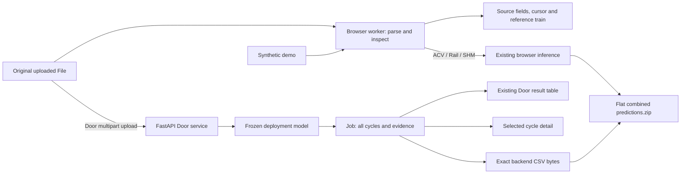

# Frozen Door backend integration

This change runs uploaded Door inference through the supplied Python pipeline while preserving the existing multisystem React workspace, 3D scene, browser field inspection and synthetic demo. Development stays on `integration/frozen-door-model`; this integration does not merge to `main` or retrain any model.

## Runtime boundary



`SubsystemWorkspace` retrieves the original File from its existing source map when `subsystem === 'door' && mode === 'uploaded'`. `createDoorClient(import.meta.env.VITE_DOOR_API_URL ?? 'http://127.0.0.1:8000')` submits that File. The validated response is converted to the existing `AnalysisResult` Door shape, and the original backend response plus `job_id` is associated with the recording's source key. Normal and Abnormal resistance cycles are both retained.

The worker still loads and inspects Door source fields, but uploaded Door prediction is rejected by the portable browser inference path. The old generic `scripts/predict.py --subsystem door` path is also rejected; the supported Door CLI is `backend/door/predict.py`. ACV, Rail and SHM keep their fitted JSON artifacts and browser worker execution. Synthetic demos keep their existing authored results and do not call the Door API.

Selecting a Door cycle updates the original source cursor to that cycle's inclusive starting row and fetches its detail endpoint. AbortController cancellation and request sequencing prevent an older detail request from overwriting a newer cycle, recording or job selection. Source modes and subsystems retain separate sessions. Network, invalid-response and expired-job errors remain visible; they never turn into a Normal prediction or an authored demo result.

## Deployment artifact and environment

The production API and Door CLI both load this fixed path:

```text
backend/door/models/door_model.joblib
```

There is no production model-path environment override or CLI `--model` switch. `validation_model.joblib` is never selected for application inference. The artifact was copied byte-for-byte from the supplied package and was not fitted, edited or converted during integration.

| Property | Value |
| --- | --- |
| Model name | `logistic_regression` |
| Model ID | `7a34ab10e5140f7e` |
| Deployment SHA-256 | `077e4a21838857e4b6bb2e5d2c9b9e1c7741a84d00c52a2d41ecb2489750ea7c` |
| Supplied deployment training count | 110 labelled cycles |
| Tested Python | 3.13.5 |
| Package compatibility | Python 3.11+ with the pinned requirements |
| Core package versions | NumPy 2.3.5, SciPy 1.17.0, scikit-learn 1.8.0, joblib 1.5.3 |

The loader checks the artifact format and exact scikit-learn version. `backend/door/models/model_metadata.json` preserves the supplied metadata. The original package remains under `backend/door/railwitness_door_pipeline/` as reference material, including its validation artifact and reports; the runnable integration uses the files directly under `backend/door/`.

See the root [README](../README.md#run-locally) for two-terminal startup. `.env.local.example` documents `VITE_DOOR_API_URL`; `.env.local` is ignored. The service defaults to localhost and explicitly allows frontend origins on localhost/127.0.0.1 ports 5173 and 3000. `RAILWITNESS_CORS_ORIGINS` can change that allowed-origin list. It does not change the model path.

## API contract

| Method and path | Behavior |
| --- | --- |
| `POST /api/door/predict` | Multipart `file` containing raw CSV; returns provenance, job ID, all segments, counts, warnings and download URLs |
| `GET /api/door/jobs/{job_id}/cycles/{cycle_index}` | Zero-based cycle selection; returns recorded signals, normal training reference, features and signed contributions |
| `GET /api/door/jobs/{job_id}/predictions.csv` | Exact UTF-8 `door_predictions.csv` bytes |
| `GET /api/door/jobs/{job_id}/predictions.zip` | `predictions.zip` with only root-level `door_predictions.csv` |

The API also exposes `/api/health`, `/api/door/model` and FastAPI `/docs`. The root route describes the service; the existing Vite app remains the user interface.

Uploads are limited to 25 MiB and must contain the 17 required controller fields. Header order can vary; missing/ambiguous required fields, malformed numeric values, infinity, unsupported timestamps and duplicate/backward timestamps are rejected. Extra columns do not establish an asset identity. Raw native timestamp strings are preserved in predictions; the final native timestamp component is integer milliseconds, so `...-92` means 92 ms.

Each returned segment includes `cycle_index`, recording-local `cycle_id`, `start_index`, `end_index`, native `start_time`/`end_time`, exact prediction label, inferred operation, model score, source row count and warnings. Row indices are **zero-based and inclusive**. They are added from the supplied segmenter's existing `lo`/`hi` bounds without changing segmentation or classification. These fields are response metadata and do not enter the submission CSV.

Successful jobs retain parsed samples, feature vectors, segment results and generated CSV in process memory for up to one hour, with a maximum of six jobs. Oldest jobs are evicted when capacity is reached. Restarting the service clears jobs. Upload handling may use temporary local files; the app does not intentionally persist raw datasets. A 404 explains that the analysis has expired or is unavailable and asks the user to re-analyse or upload the original CSV again. Bad input returns 422, oversized input 413 and unavailable/incompatible deployment models 503. No error response includes invented prediction rows.

## Frozen segmentation, features and model

The supplied gap segmenter starts a cycle after an adjacent timestamp gap greater than **451.9955751995809 ms**. That frozen threshold was learned from the geometric mean of the training stream's largest within-cycle interval (20 ms) and smallest between-cycle gap (10,215 ms). Neither the number of cycles nor their labels is hardcoded. Every accepted segment uses its first and last recorded row. Isolated one-row segments are rejected; unusual sampling and lengths outside the training range produce quality warnings.

This rule is specific to the supplied gap-separated acquisition format. It is not validated for arbitrary uninterrupted live telemetry, interleaved physical assets or long within-cycle dropouts.

The frozen classifier receives **97 cycle features** covering inferred operation, duration, position change/travel, whole-cycle and moving-region current/voltage/back-EMF/speed statistics, electrical integrals, low-speed fraction and five normalized-position bins. Absolute timestamps, cycle IDs, filenames, preceding/following gaps, physical identities and controller opening/closing-time settings are excluded from the classifier inputs.

The supplied learned preprocessing performs median imputation, zero-variance feature removal and standard scaling before L2 logistic regression (`C=0.1`). The deployment fit has 96 active features after one constant feature is removed. Integration does not change these steps, hyperparameters, coefficients, features or reference arrays.

Small missing-value gaps are interpolated within a completed cycle using the supplied runtime and produce warnings. More than 10% missing in a required signal globally or within a cycle is rejected. There is no interpolation across cycle boundaries. Display evidence should be read together with these warnings; interpolation is an offline preprocessing operation, not an additional recorded sensor observation.

## Evidence semantics

Backend detail values already use their display units:

| Backend value | UI meaning |
| --- | --- |
| `current_A` | Amperes; backend already divided source mA by 1000 |
| `voltage_V` | Volts; backend already multiplied source 10 mV units by 0.01 |
| `position_raw` | Original unspecified position units |
| `bemf_raw` | Original unspecified back-EMF units |
| `elapsed_fraction` | Normalized elapsed cycle time; display as 0–100% time |
| `travel_fraction` | Separate within-cycle normalized position context, when available |
| `reference.lower_A` / `median_A` / `upper_A` | Empirical 5th/50th/95th current percentiles from Normal training cycles |

React does not convert current or voltage a second time. The observed/reference chart uses **Normalized elapsed cycle time (%)**, never “door travel %”. The empirical reference uses 101 elapsed-time points and separate inferred Open/Close groups (40 Normal training cycles each in the supplied deployment artifact). It is descriptive only: not a calibrated prediction interval, quantile gradient boosting model or classifier threshold.

The classifier output is an **uncalibrated model score**. It is not a probability of physical failure. Feature contributions are signed contributions to logistic log-odds after the frozen preprocessing: positive pushes toward **Abnormal resistance**, negative pushes toward **Normal**. The strongest contributions explain the model decision; correlated features share influence and do not diagnose a specific mechanical component.

The evidence panel identifies the selected recorded cycle, exact label, score, strongest contributions, quality warnings and advisory recommendation. The source supplies no reliable physical car/door identity. `asset_id` stays null, cycle numbers are never mapped to rendered door numbers, and the 3D scene remains an illustrative reference layout. No future-cycle verification or train-health percentage is introduced.

## Exact exports

The backend writes this schema, with native timestamps and both classes:

```csv
start_time,end_time,prediction
```

It does not add a file ID, confidence, cycle ID or alternate label spelling. The frontend downloads those exact bytes. For combined ZIP export it obtains the selected uploaded Door job's CSV bytes and places them directly at `door_predictions.csv`; ACV/Rail/SHM retain their existing frontend export logic. No reconstructed Door CSV is substituted if the job is missing or expired.

Only successfully analysed subsystems enter the flat ZIP. The currently selected analysed Door recording supplies the single Door file because its schema has no file identifier. Demo exports are separately labelled and excluded. The backend ZIP endpoint independently produces the same Door CSV as its sole root entry.

## Validation and acceptance

The supplied model's internal evaluation reserved training cycles **89–110**: 22 same-source cycles with 15 Normal and 7 Abnormal labels. The selected specification fitted on the preceding 88 cycles achieved IoU-weighted F1 1.000 with exact boundaries. The supplied deployment artifact was subsequently fitted on all 110 labelled training cycles. That deployment fit did not produce the holdout score. This integration only loads it.

These are internal training-data validation results, not organiser Test performance, leave-one-door-out validation or proof of operational reliability. The current Door evidence is recorded in the supplied [MODEL_REPORT.md](../backend/door/railwitness_door_pipeline/MODEL_REPORT.md) and [final_holdout.json](../backend/door/railwitness_door_pipeline/reports/final_holdout.json). The old Door entry in `docs/model-validation.json` belongs to the superseded browser model.

The integrated service was independently exercised over HTTP with the local organiser `Test.csv`. Its bytes match the supplied package receipt for `Test(1).csv`:

```text
Source SHA-256:      8cbea142cf46eac40455ddcac17e334c1842a6f7632f006e48c7d0d41582bfe3
Predictions SHA-256: 2f94f8f5e2ccd6bce223a7c2f9fd2c7b974aa17cbce3d7bc3521dd100d7a079b
```

That run returned **38 cycles, 30 Normal and 8 Abnormal resistance**, covering all **6253 source rows exactly once**. All 38 detail endpoints succeeded and retained the cycle's samples. The returned CSV was byte-equal to the supplied pipeline's generated `outputs/door_predictions.csv`; the ZIP contained the same bytes at its root. These counts are predictions, not ground truth. No Test labels were available, no Test score was calculated, and no example submission was used as labels. A separate three-row valid upload returned one cycle, confirming counts are input-dependent.

The [integration acceptance receipt](../backend/door/reports/integration_acceptance.json) records these checks. The original package's 35 pytest tests passed independently. The integrated suite passed 46 tests with the optional external acceptance recording enabled, covering the original behavior plus frozen identity, complete row coverage, units/reference integrity, expiry/eviction, model failure, upload bounds and CORS. A dependency-level AnyIO deprecation warning does not affect test results.

Reproduce backend acceptance without storing organiser data in the repository:

```sh
cd backend/door
source .venv/bin/activate
python -m pip install -r requirements-dev.txt
DOOR_ACCEPTANCE_CSV=/path/to/Test.csv python -m pytest -q
```

The frontend checks are `npm run typecheck`, `npm run build`, `npm test`, and `npm run test:e2e`. Playwright starts both Vite and the backend; its default Python is `backend/door/.venv/bin/python`, overridable with `RAILWITNESS_DOOR_PYTHON`. `RAILWITNESS_DOOR_TEST_CSV` enables the actual-recording browser case. Current frontend run results belong in [BUILD_STATUS.md](BUILD_STATUS.md), not in the model's predictive validation score.

## Later submission packaging

The development repository remains convenient for local work. A later official package can use:

```text
<Team Name>/
├── demo_video.mp4
├── predictions.zip
├── app/
│   ├── frontend source/build and startup instructions
│   └── backend/door/
│       ├── app.py
│       ├── door_pipeline/
│       ├── requirements.txt
│       ├── predict.py
│       └── models/
│           ├── door_model.joblib
│           └── model_metadata.json
└── Optional_Items/
    └── Door/model/  # Optional validation artifact/reports
```

The compulsory app must include its deployment model and Python runtime code. A static frontend-only bundle cannot run uploaded Door inference. `validation_model.joblib` and historical validation reports may accompany optional evidence; they must not replace `app/backend/door/models/door_model.joblib`. Copy only selected runtime/evidence files from the retained original package.

Exclude `.venv`, `.tools`, `node_modules`, raw organiser datasets, local environment files, API keys and work credentials. Do not package the whole development repository by copying it blindly. This integration neither publishes a submission nor merges the branch to `main`.

## Integration change map

- Backend runtime: `backend/door/app.py`, `door_pipeline/`, `predict.py`, pinned `requirements*.txt`, `models/door_model.joblib`, `models/model_metadata.json`, `pytest.ini`, `tests/`, and `reports/integration_acceptance.json`. The pre-existing nested supplied package was preserved unchanged.
- Frontend API and state: `src/lib/railwitnessDoorClient.ts`, `src/lib/doorBackendAnalysis.ts`, `src/lib/useDoorCycleDetail.ts`, and `src/pages/SubsystemWorkspace.tsx`/`.css`.
- Evidence presentation: `src/components/door/DoorCycleEvidence.tsx`/`.css`.
- Routing/export enforcement: `src/workers/analysis.worker.ts`, `src/lib/inference.ts`, `src/lib/exportPredictions.ts`, and `scripts/predict.py`.
- Configuration and verification: `.env.local.example`, `.gitignore`, `playwright.config.ts`, `tests/doorBackend.test.ts`, `tests/exportPredictions.test.ts`, `tests/inference.test.ts`, `tests/inference.integration.test.ts`, and `tests/browser/door-backend.spec.ts`.
- Documentation: `README.md`, this file, `docs/TRAINED_MODELS.md`, and `docs/BUILD_STATUS.md`.

The repository remains on the requested branch. No commit, push, merge or official submission was performed by this integration.
